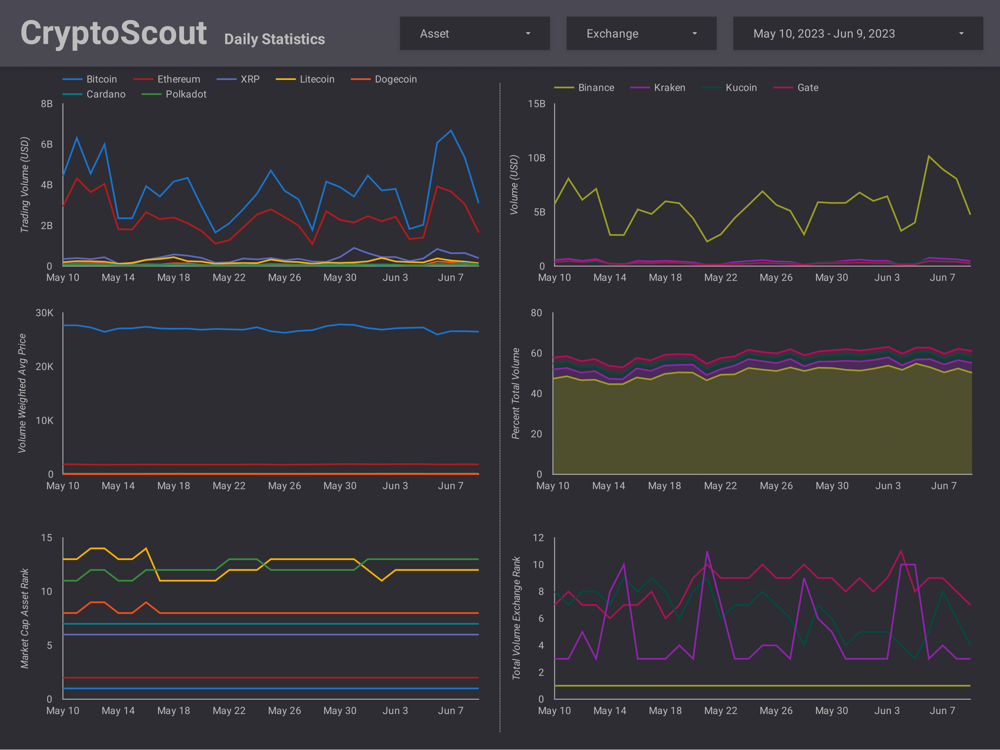

# CryptoScout
A data pipeline deployed on Google Cloud that extracts cryptocurrency data for analytics. Integrates tools such as Airflow, Spark, dbt, Docker, Terraform, and various GCP services!

## Description

### Objective
The main objective is to deliver a pipeline which automates the daily extraction of cryptocurrency data and serves it up for analytical workloads (OLAP). At a high level, the batch data pipeline consumes source data, stores it in a data lake, transforms it, and materializes dimensionally modelled tables in a data warehouse suited for analytical reporting. Lastly, a [dashboard](https://lookerstudio.google.com/reporting/15f06695-3106-42aa-b17a-4bb9743a987f) is connected to the data warehouse for visualization and analysis of the modelled data.

The following secondary design and personal objectives were kept in mind when designing the pipeline:
1. Ease of scalability with future source data increases
2. Minimize GCP cloud service costs
3. Learn as much as possible! Gain exposure to different tools and technologies while integrating them together

### Source Data
All source data used in this project is extracted from different [CoinCap](https://coincap.io/) API endpoints. While some endpoints used offer historical data, others offer only snapshotted time-of-request data. CoinCap itself is a tool which collects real-time cryptocurrency exchange data from multiple markets.

- The pipeline was run for approximately a month (May 2023), with historical data backfilled from Jan 2022.
- Due to API rate limitations, as well as an effort to keep GCP costs low, only a limited subset of cryptocurrency assets and exchanges are considered for the limited purposes of this project.
- Unfortunately, CoinCap stopped supporting the `/candles` endpoint in early 2023.

### Tools / Technologies
| Type / Purpose | Tooling |
|---|---|
| Cloud Infrastructure | [Google Cloud Platform (GCP)](https://cloud.google.com/) |
| Infrastructure as Code (IaC) | [Terraform](https://www.terraform.io/) |
| Orchestration | [Apache Airflow](https://airflow.apache.org/) |
| Containerization | [Docker](https://www.docker.com/), [Docker Compose](https://docs.docker.com/compose/) |
| REST API data ingestion service | [FastAPI](https://fastapi.tiangolo.com/) |
| Data Quality Validation | [Pydantic](https://docs.pydantic.dev/latest/), [dbt](https://www.getdbt.com/) |
| Data Transformation / Modelling | [Apache Spark](https://spark.apache.org/), [dbt](https://www.getdbt.com/) |
| Data Lake | [Google Cloud Storage (GCS)](https://cloud.google.com/storage) |
| Data Warehouse | [BigQuery](https://cloud.google.com/bigquery) |
| Data Visualization  | [Looker Studio](https://lookerstudio.google.com/overview) |

## Data Pipeline Architecture

<details>
    <summary>Airflow DAG</summary>


</details>

<details>
    <summary>dbt DAG</summary>


</details>

## Dimensional Model
A Kimball methodology was applied to dimensionally model the data in the data warehouse. An ERD depicting the relationships between fact and dimension tables is presented below:


## Analytics Dashboard
[Click here](https://lookerstudio.google.com/reporting/15f06695-3106-42aa-b17a-4bb9743a987f) to interact with the dashboard!

[](https://lookerstudio.google.com/reporting/15f06695-3106-42aa-b17a-4bb9743a987f/page/o9GQD)
[](https://lookerstudio.google.com/reporting/15f06695-3106-42aa-b17a-4bb9743a987f/page/p_ni37nsq25c)

## Getting Started
The steps below assume you are developing in a Linux environment.

### Setup & Prerequisites
1. [Create](https://cloud.google.com/resource-manager/docs/creating-managing-projects#creating_a_project) a new GCP project
2. Local system installation of:
    - [Terraform](https://developer.hashicorp.com/terraform/downloads) available on your [PATH](https://developer.hashicorp.com/terraform/tutorials/gcp-get-started/install-cli#install-terraform)
    - [gcloud CLI](https://cloud.google.com/sdk/docs/install-sdk)
    - [Docker](https://docs.docker.com/engine/install/) and [Docker Compose](https://docs.docker.com/compose/install/)
    - [Python 3](https://www.python.org/downloads/)

### Installing Dev Tools (Optional)
This project uses [pipx](https://pypa.github.io/pipx/) to install dev tools from PyPI in isolated Python environments. The following dev tools are installed with pipx:
- [black](https://pypi.org/project/black/) - Python code formatter
- [flake8](https://pypi.org/project/flake8/) - Python linter
- [isort](https://pycqa.github.io/isort/) - Python import sorter
- [mypy](https://mypy.readthedocs.io/en/stable/) - Python static type checker
- [sqlfluff](https://sqlfluff.com/) - SQL linter and formatter

Install pipx by running the following command in the current directory:
```bash
make install-pipx
```

Once pipx is installed, the dev tools listed above can be installed as follows:
```bash
make pipx-devtools
```

Project-wide code formatting, typing, and linting can then be applied:
```bash
make ci
```

### Deploying to GCP
Data pipeline deployment to Google Cloud is fully defined and managed by Terraform. For details on how to set up GCP infrastructure with Terraform [click here](terraform/README.md).

## Potential Improvements
- Deploying a Cloud Run service is overkill for data ingestion. While developing, containerizing, and deploying an API service was a good learning experience, it would have been simpler to develop Cloud Run Jobs or Cloud Functions to ingest the data.
- Dataproc Serverless startup and shutdown of compute adds overhead time for each DAG run. Deploying a Dataproc cluster would resolve this for a higher cost if Spark jobs needed to be run.
- Replace the Spark jobs with Python processes; Spark is overkill for the small volume of daily data dealt with in this project.
- Build fact tables incrementally instead of doing a full refresh to reduce dbt build time as tables accumulate more data over time.
- Deploy a production version of Airflow via Helm Charts (GKE deployment) or use a managed version of Airflow (Cloud Composer, Astronomer, etc.)
- Add more integration tests and end-to-end pipeline tests
- Add more data validation and quality checks
- Improve data pipeline monitoring and alerting
- Implement CI/CD
