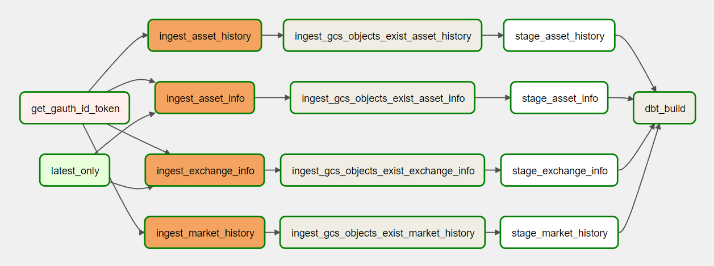

# Apache Airflow
The data pipeline tasks are scheduled and orchestrated by [Apache Airflow](https://airflow.apache.org/). A modified Docker compose file has been provided to spin up Airflow container services on a single machine.

## Pipeline DAG


## Running Airflow
### Startup
To run Airflow via Docker Compose, execute the following in the current directory:
1. Initialize Airflow backend services (first-time setup)
    ```bash
    make airflow-init
    ```
2. Start up all Airflow container services in detached mode
    ```bash
    make up
    ```

Once the webserver is running, the Airflow GUI can be accessed at http://localhost:8080/

**Note**: spinning up the containers defined in [`docker-compose.yaml`](./docker-compose.yaml) requires `req.env` and a valid GCP service account keyfile `airflow-sa-key.json`. Refer to the [*Local Dev Environment Config* section of the Terraform README](../terraform/README.md#local-dev-environment-config) for details.


### Shutdown
To terminate all running container services, execute:
```bash
make down
```