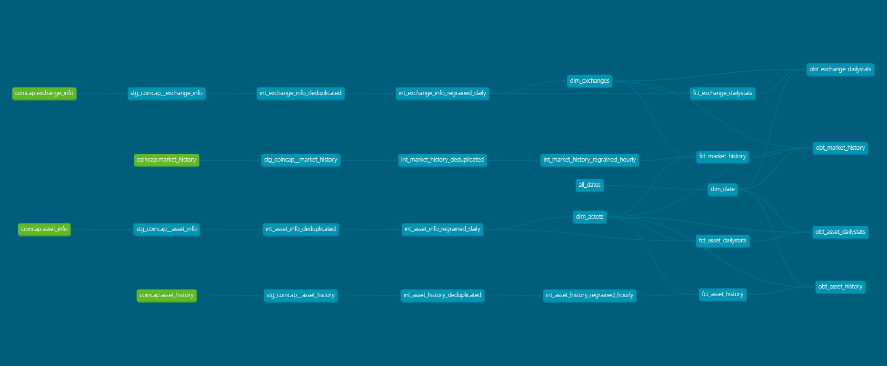

# dbt: Data Build Tool
The pipeline's data modelling step is handled by [dbt](https://www.getdbt.com/), a tool which specializes in facilitating in-warehouse data transformations (the T in ELT). Some other features include table model lineage, auto-generated data documentation, and data testing functionality.

## Table Lineage / DAG
The project materializes tables in BigQuery for analytics and reporting.
- **Dimensional Model**
- **One Big Table (OBT) / Wide Table**

